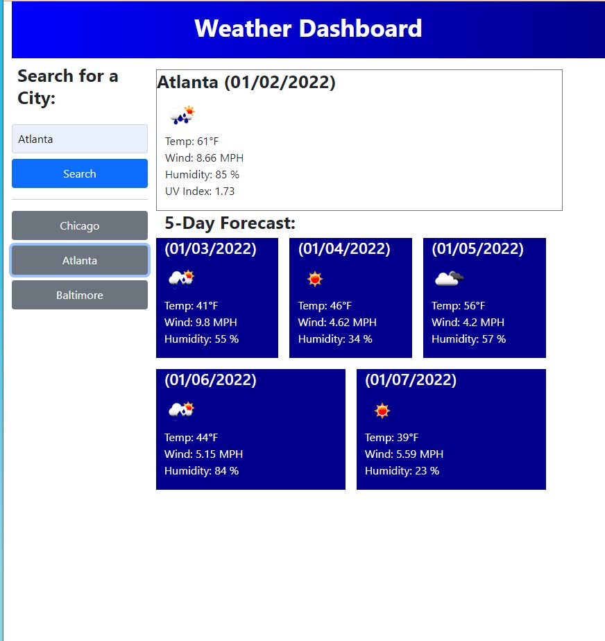

# Weather-Dashboard

# Description

This webpage is a simple Weather Dashboard application that I created using jQuery and an API service called OpenWeatherMap. One of the main reasons why I created this application was to practice making API calls and utilizing the data that returned in a variety of ways. In this project I worked closely with moment js again as well as the localstorage feature of the google chrome web browser.

https://jaredinyaagha1.github.io/Weather-Dashboard/
